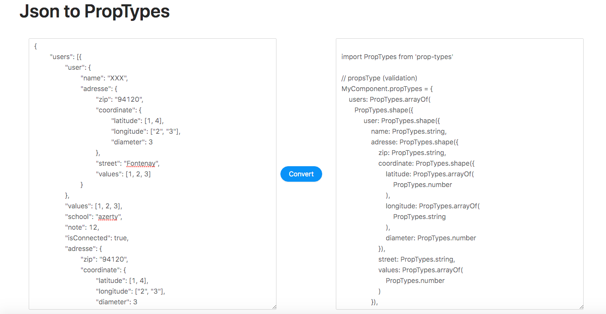

# react-json-to-proptypes
Convert Json to React Proptypes (propTypes & defaultProps with nested object structure)

## How to use ?

https://json-to-react-proptypes.netlify.app/

## Input example 

```json
{
	"users": [{
		"user": {
			"name": "XXX",
			"adresse": {
				"zip": "94120",
				"coordinate": {
					"latitude": [1, 4],
					"longitude": ["2", "3"],
					"diameter": 3
				},
				"street": "Fontenay",
				"values": [1, 2, 3]
			}
		},
		"values": [1, 2, 3],
		"school": "azerty",
		"note": 12,
		"isConnected": true,
		"adresse": {
			"zip": "94120",
			"coordinate": {
				"latitude": [1, 4],
				"longitude": ["2", "3"],
				"diameter": 3
			},
			"street": "Fontenay",
			"values": [1, 2, 3]
		}
	}],
	"local": {
		"lang": "fr"
	},
	"config": [{
		"env": "Test",
		"local": "fr"
	}],
	"date": "14/04/202",
	"numberOfConnection": 2900,
	"isEmpty": false
}
```

## Output 

```js
import PropTypes from 'prop-types'

// propsType (validation)
MyComponent.propTypes = {
    users: PropTypes.arrayOf(
       PropTypes.shape({
            user: PropTypes.shape({
                name: PropTypes.string,
                adresse: PropTypes.shape({
                    zip: PropTypes.string,
                    coordinate: PropTypes.shape({
                        latitude: PropTypes.arrayOf(
                            PropTypes.number
                        ),
                        longitude: PropTypes.arrayOf(
                            PropTypes.string
                        ),
                        diameter: PropTypes.number
                    }),
                    street: PropTypes.string,
                    values: PropTypes.arrayOf(
                        PropTypes.number
                    )
                }),
            }),
            values: PropTypes.arrayOf(
                PropTypes.number
            ),
            school: PropTypes.string,
            note: PropTypes.number,
            isConnected: PropTypes.bool,
            adresse: PropTypes.shape({
                zip: PropTypes.string,
                coordinate: PropTypes.shape({
                    latitude: PropTypes.arrayOf(
                        PropTypes.number
                    ),
                    longitude: PropTypes.arrayOf(
                        PropTypes.string
                    ),
                    diameter: PropTypes.number
                }),
                street: PropTypes.string,
                values: PropTypes.arrayOf(
                    PropTypes.number
                )
            }),        }),
    ),
    local: PropTypes.shape({
        lang: PropTypes.string
    }),
    config: PropTypes.arrayOf(
       PropTypes.shape({
            env: PropTypes.string,
            local: PropTypes.string
        }),
    ),
    date: PropTypes.string,
    numberOfConnection: PropTypes.number,
    isEmpty: PropTypes.bool
}

// default props
MyComponent.defaultProps = {
    users: [],
    local: {
        lang: null
    },
    config: [],
    date: null,
    numberOfConnection: 0,
    isEmpty: false
}
```


